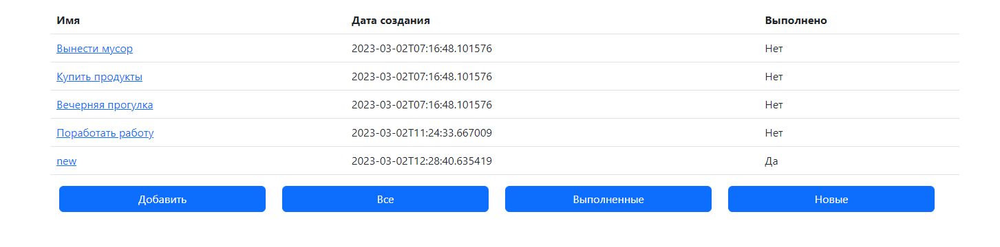
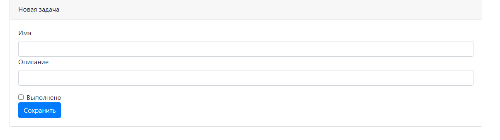
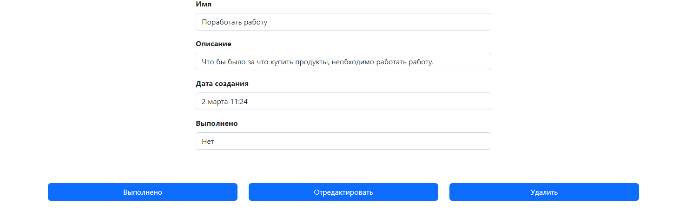
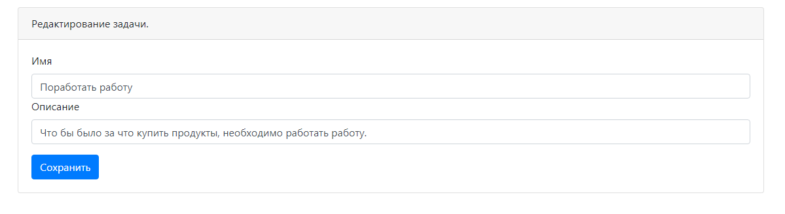

#job4j_todo

Проект по контролю над задачами.
Представляет собой веб-сайт который дает возможность создавать, редактировать 
и удалять задачи которе представленны на странице, выбрать задачу и отметить ее выполнение.

#Технологии:
Spring boot, Thymeleaf, Bootstrap, Hibernate, PostgreSql

#Требования к окружению:
Java 17, Maven 3.8, PostgreSQL 14

#Главная страница со списком задач

#Форма для добавления новой задачи

#Окно для просмотра задачи

#Окно для редактирования задачи
